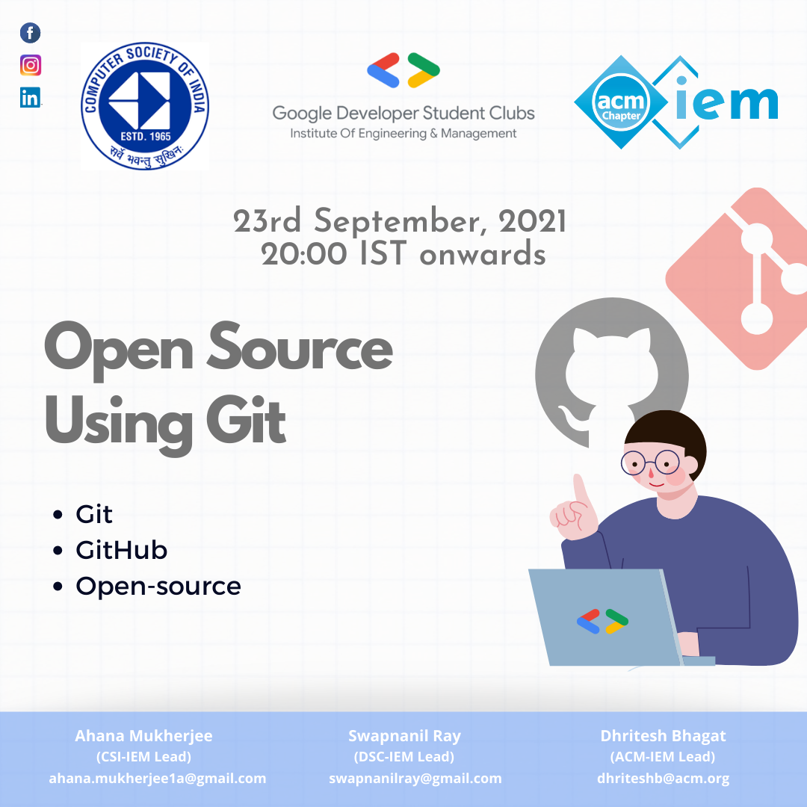

<h1 align="center">Open Source Using Git</h1>
<h3 align="center">A Joint Event By GDSC | ACM | CSI</h3>

## Objective
The session aims at teaching students and all attendees the basics of git and imbibe the sense of contributing to Open Source Software.

The session will walk through several topics like:
- Open Source
- Version Control
- How to use git and github

The events also tries to provide an over-view of Hacktober Fest'21 for the interested and upcoming Open Source enthusiasts, thereby fostering greater contribution by and to the community

## List Of Contributors:
- [whokilleddb](https://www.youtube.com/watch?v=dQw4w9WgXcQ)
- [Dsantra92](https://github.com/Dsantra92)
- [Pritam Kundu](https://warmachine028.github.io)
- [RickAstley](https://www.youtube.com/watch?v=dQw4w9WgXcQ)

